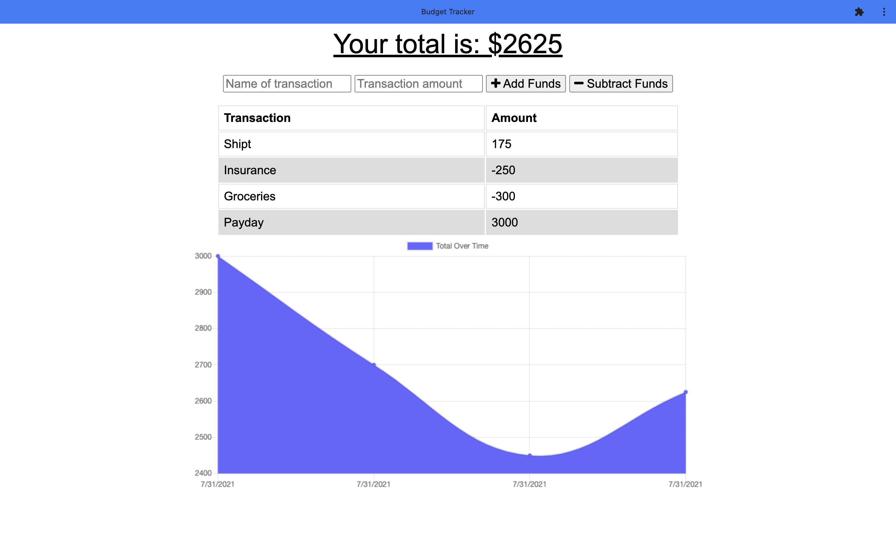

# Budget Tracker

## Description 
Budget tracker is a progressive web application that was designed to help the user easily track their budget. The user can either add deposits or subtract expenses and will get their budget total and a graph to visualize their budget flow in a graph form. 

## Installation 
This is a progressive web application - meaning it can be used through the browser on the website itself, or the user can install the application locally on either their phone or computer. 

To install the application onto your device, click the icon on the right of the search bar. Depending on your web browser, it will either be a plus sign or a computer screen with a arrow pointing downward.

## Usage 
To use this app, navigate to the <a href="http://stormy-woodland-95286.herokuapp.com">budget tracker website</a> and use in the web browser, or install the budget tracker application on your device. 

## Credit 
This application was made possible thanks to <a href="https://github.com/coding-boot-camp/symmetrical-bassoon">this starter code</a>, and was transformed into a PWA by myself: <a href="https://github.com/angeeg">angeeg</a>.
